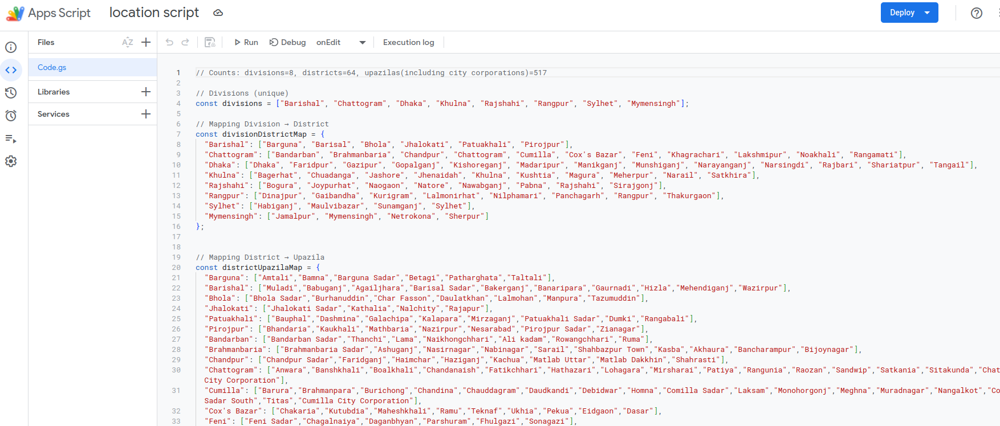

# bangladeshi-locations-in-google-sheet
This repository is highlighting a google sheet script for adding "Division", "District" and "Upazila" selection fields in different columns in a google sheet

# Features

- **Division** list will be loaded in a column.
- When user selects a **Division** corresponding **District** list (within the selected division) will be loaded at another column.
- When user selects a **District** corresponding **Upazila** list (within the selected district) will be loaded at another column.
- Initially, **District** and **Upazila** related columns will remain empty.
- If user clears **Division** selection, both **District** and **Upazila** column's dropdown will be cleared.
- If user clears **District** selection, **Upazila** column's dropdown will be cleared.

# Location data source

Data is collected from this repository (after some verification and validation): https://github.com/ifahimreza/bangladesh-geojson

**Note that**, I have added **City Corporations** at the **Upazila** list.

# Process of using the script

You should have three dedicated columns for **Division**, **District** and **Upazila** selection.

## Step 1 - Adding the script to the sheet

From **Extensions** select **App Script**:

A new tab will be opened for adding script. Paste the script code at the **Code.gs** file.

# Customize the script and load initial location data

There are two functions in the script **onEdit** and **setupDivisionAndDistrictAndUpazilaDropdowns**. We will run the **setupDivisionAndDistrictAndUpazilaDropdowns** function manually to load initial data.

Select **setupDivisionAndDistrictAndUpazilaDropdowns** at top:

You can run the script by clicking on the **Run**. But at first confirm the sheet you want to edit and also columns by editing following variables at the script:

Note that, there is a variable named **lastRow** inside the **setupDivisionAndDistrictAndUpazilaDropdowns** function. You can edit it to fix the row until which you want to load initial (division) data. For now, from 2nd row to 10th row is populated initially.

# Important note

**Google sheet update doesn't become visible immediately**. You need to click on a differet cell to trigger the re-render of the sheet and relevant changes will become visible. 

Example - After updating **division** selection, click on a different cell and than dropdown with the relevant **districts** will become available. 
